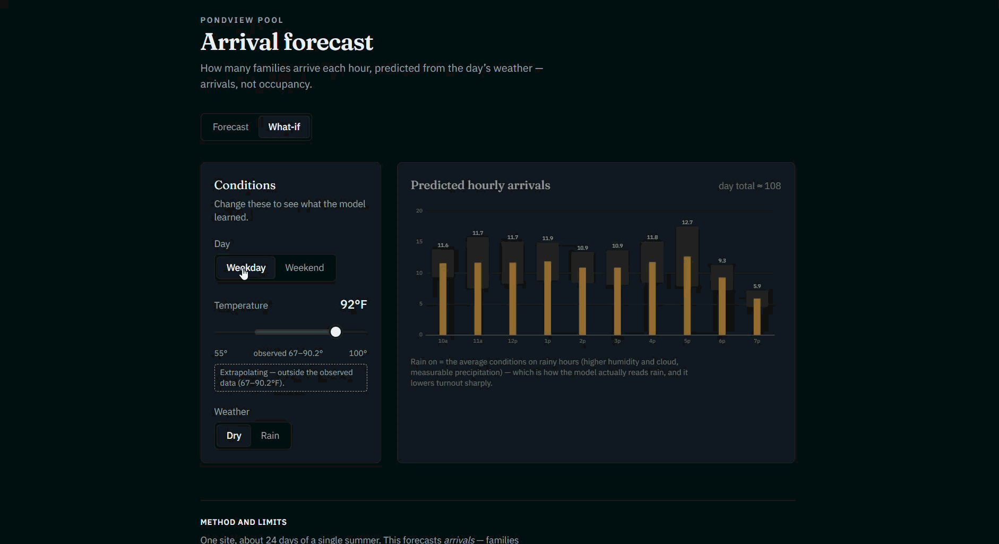

# Pondview pool arrival forecaster

Predicts how many families will arrive at a community pool in each open hour of a given
day, from the day's weather — and lets you explore what the model learned. See the
[live forecast page](https://pondviewforecast.vercel.app). The model is a scikit-learn regressor served
from AWS Lambda (a container image) behind a small FastAPI service; the frontend is a
Next.js app on Vercel.

## Screenshots

Forecast view (live page):


What-if view:

<div>
  
</div>

FastAPI interactive docs (`/docs`):


## What it predicts — arrivals, not occupancy

The target is **family arrivals per hour**: the number of sign-in lines recorded in each
clock hour. It is deliberately **not occupancy**. The pool logs arrivals on paper
sign-in sheets but never records when a family leaves, so how many people are present at
any moment is unknown and unmodeled. Everything here — the data, the metrics, the API
response — is counts of arrivals, not people in the water.

## How it fits together

One repo, three tiers, deployed independently:

```
paper sign-in sheets
  model/  transcribe -> hourly table (arrivals + Open-Meteo weather) -> scikit-learn
          -> model.joblib + model_context.json (leave-one-day-out error, baseline, ranges)
  api/    FastAPI on AWS Lambda (container): GET /forecast, POST /whatif
  web/    Next.js on Vercel: Forecast + What-if views, calling the Lambda URL
```

A diagram of the same flow lives at `docs/[FILL: path]` (architecture.png).

## The model (`model/`)

**Data.** The training table covers **197 observed hours across 24 days**, from
**2026-07-08 to 2026-08-04** — a few weeks of a single summer at one site. Those hours
hold **1,166 arrivals**, a mean of **5.92 arrivals/hour**, and **39 zero-arrival hours
(19.8%)**.

The hour grid comes from the day log, not from the arrivals, and that choice is the
intellectual core of the project. The zeros are informative. A day is included only when
its open and close hours are verified; **days the pool was closed, and days whose
sign-in sheet was lost, are left out entirely**, because we cannot say what happened
during them. But days the pool was open and *nobody came* are kept as genuine
zero-turnout hours. Dropping those would delete exactly the bad-weather signal the model
is meant to learn; inventing zeros for lost-sheet days would fabricate turnout that never
happened. Keeping only verified-open days — busy or empty — is the honest middle.

**Results.** Evaluated with leave-one-day-out cross-validation (24 folds, one per day);
MAE is mean absolute error in family arrivals per hour, lower is better.

| model | MAE (families/hour) |
| --- | --- |
| baseline (hour-of-day × weekend mean) | 4.24 (±1.94) |
| gradient-boosting model | 2.91 (±1.63) |
| improvement | 31.4% |

The baseline — a lookup table of average arrivals by hour and weekend/weekday — is
reported alongside the model every time; beating it by a modest, honest margin is the
result, not a disappointment. The model's largest gains are on **cool hours** (MAE
**1.40** families/hour lower) and **weekends** (1.27 lower). A feature ablation
([`model/ablation.py`](model/ablation.py)) confirms the edge comes from weather, not the
calendar: a weather-only model already beats the baseline, a calendar-only model does not.

**Method notes.** We split by day (never by row): hours in one afternoon share weather
and crowd, so a row-level split would leak a day's conditions into training. The deployed
artifact is fit on **all** rows — the folds exist only to evaluate honestly. Retraining
happens offline (`model/train.py`), roughly once a season; the model is baked into the
image, so the Lambda only ever predicts.

## The API (`api/`)

- `GET /forecast?day=YYYY-MM-DD` → per-hour `{hour, predicted, low, high}` plus a `basis`:
  - `forecast` — live Open-Meteo weather (in season, within ~16 days).
  - `typical` — in season but beyond the forecast horizon: the historical
    hour × weekend baseline, banded from its own spread. Returned instead of an error.
  - `closed` — outside the pool season: a calm closed state, no per-hour numbers.
- `POST /whatif` → the hourly curve under supplied conditions (weekend, temperature, rain
  on/off), with an `extrapolating` flag when the temperature is outside the observed range.
- `GET /health`, `GET /` — status and a self-describing landing payload.

The uncertainty bands are the model's **actual leave-one-day-out error per hour**, not
quantile-regression intervals — on 24 days those couldn't be calibrated, so we report the
error we can defend. Only genuinely malformed input returns `422`; season and horizon are
legitimate states, not client errors.

Weather comes from [Open-Meteo](https://open-meteo.com/) under their free API — see
Attribution below.

## The frontend (`web/`)

A Next.js + TypeScript app with two views behind a segmented control:

- **Forecast** — pick a day, see the banded hourly bar chart and an honest basis badge
  (live / typical / closed), with a real cold-start loading state for the Lambda.
- **What-if** — toggle weekend, drag a temperature slider (which shades the observed
  training range and flags extrapolation), and turn rain on/off, to watch the model's
  learned response live. Rain sharply lowers predicted turnout.

The frontend calls the backend by its deployed **Lambda URL** (an env var), and deploys
separately from the API — a `web/**` commit does not redeploy the Lambda (see
`.github/workflows/deploy-api.yml`).

## Limitations

- **One site.** A single community pool; nothing here is validated to transfer elsewhere.
- **One partial season.** 24 days of one summer — no holidays, no full-season arc, no
  year-over-year signal to learn from.
- **Arrivals, not occupancy.** No departure data, so nothing about how full the pool is.
- **Thin weather variance.** Temperature spans just 67–90 °F (std 4.3), and only **23 of
  197 hours (11.7%)** had measurable rain. The bands are rough typical error from
  cross-validation, **not** statistical confidence intervals, and the site assumes normal
  posted hours — it does not model day-specific early closures.

## Reproducing it

Requires **Python 3.11** (it matches the Lambda base image, and the model is pinned to
libraries with compatible Linux wheels). From the repository root:

```bash
py -3.11 -m venv .venv311
.venv311\Scripts\python -m pip install -r requirements.txt
```

The real sign-in data is resident pool data and is **not** in this repo. A small
**synthetic sample** (`model/data/sample/`) stands in so the pipeline runs end-to-end:
`build_dataset.py` uses the real data when present and otherwise falls back to the sample
(writing `hourly_sample.csv`, so it never touches the committed real aggregate).

```bash
# Build the hourly table. With the real data absent, this reads model/data/sample/.
.venv311\Scripts\python model\build_dataset.py

# Train + evaluate (baseline vs model), write model.joblib + model_context.json.
# Runs from the committed model/data/processed/hourly.csv -- no raw data needed.
.venv311\Scripts\python model\train.py

# Serve the API locally (ALLOWED_ORIGINS enables CORS for a browser frontend).
.venv311\Scripts\python -m uvicorn api.main:app --reload --port 8000
```

`curl "http://127.0.0.1:8000/forecast?day=2026-08-06"` returns a banded forecast; `/docs`
is the interactive UI.

## Repository layout

```
model/  fetch_weather.py     pull hourly weather from Open-Meteo
        build_dataset.py     join arrivals + weather into the hourly table
        train.py             baseline, leave-one-day-out eval, model + context sidecar
        ablation.py          does weather (vs the calendar) earn its place?
        model.joblib         the deployed model (fit on all rows)
        model_context.json   LOO error per hour, baseline, seasonal ranges
        data/processed/hourly.csv   the committed de-identified aggregate
        data/sample/                synthetic stand-in for the resident data
        notebooks/findings.ipynb    narrative walkthrough with charts
api/    main.py Dockerfile requirements.txt   FastAPI service + Lambda image
web/    Next.js frontend (Forecast + What-if)
```

## Attribution and license

Weather data by [Open-Meteo.com](https://open-meteo.com/), used under their terms
([CC BY 4.0](https://open-meteo.com/en/license)). This project is released under the MIT
License (see `LICENSE`).
